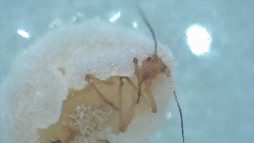

# JRL-Aphid-Fungus
JRL project on aphid fungus on wheat

Recap: In this project, we want to assess in an experimental wheat field the presence of an entomopathogenic fungus of aphids (*Sitobion avenae*<!-- [https://www6.inrae.fr/encyclopedie-pucerons_eng/Species/Aphids/Sitobion/S.-avenae] -->), determine the fungus' species and look for interactions with aphid parasitoids.

## Aphid with fungus

By:
* Adrien 
* Matthieu 
* Tania 
